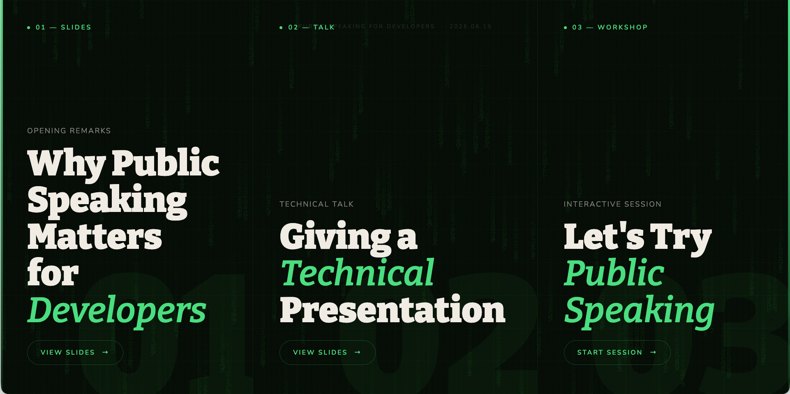

# public-speaking-for-developers

Slides for the event [Public Speaking for Developers](https://luma.com/m4if17ik).

Web: https://kaustubhhiware.github.io/public-speaking-for-developers/

----
Slides generated using [frontend-slides](https://github.com/zarazhangrui/frontend-slides).

The slides are AI-generated, the content is not.
